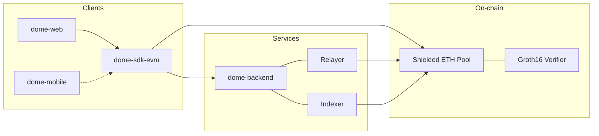

<div align="center">

```
██████╗  ██████╗ ███╗   ███╗███████╗
██╔══██╗██╔═══██╗████╗ ████║██╔════╝
██║  ██║██║   ██║██╔████╔██║█████╗  
██║  ██║██║   ██║██║╚██╔╝██║██╔══╝  
██████╔╝╚██████╔╝██║ ╚═╝ ██║███████╗
╚═════╝  ╚═════╝ ╚═╝     ╚═╝╚══════╝
```

### Private ETH on Base — powered by Groth16 zero-knowledge proofs

[](https://base.org)
[](https://soliditylang.org)
[](https://docs.circom.io)
[](https://www.typescriptlang.org)
[](https://nextjs.org)
[](https://expo.dev)
[](https://hardhat.org)
[](https://docs.circom.io)

</div>

---

## What is Dome?

**Dome** is a shielded transaction layer for Base. Users deposit native ETH into an on-chain **shielded pool**, receive private notes backed by a Merkle tree of commitments, and later withdraw to any address — without linking deposit and withdrawal on-chain.

The protocol combines:

- **Solidity smart contracts** — shielded pool, nullifiers, Merkle tree, Groth16 verifier
- **Circom circuits** — `transaction2` spend proofs (Merkle inclusion, nullifier derivation, multi-output)
- **TypeScript SDK** — deposit, withdraw, balance, session sign-in for wallets
- **Backend services** — indexer (UTXO scan + Merkle paths), relayer, JSON-RPC proxy
- **Client apps** — Next.js web wallet and Expo / React Native mobile wallet

Live network: **[Base mainnet](https://base.org)** (`chainId: 8453`).

```
  User wallet                Dome backend              Base L2
 ┌─────────────┐            ┌──────────────┐          ┌─────────────┐
 │  Sign in    │─── prove ─▶│   Indexer    │◀─ logs ─│ Shielded    │
 │  Deposit    │            │   Relayer    │── tx ──▶│ ETH         │
 │  Withdraw   │◀─ path ────│   RPC proxy  │         │ pool        │
 └─────────────┘            └──────────────┘          └─────────────┘
        │                                                    │
        └──────────── Groth16 proof (Circom / snarkjs) ──────┘
```

Session authentication uses a standard wallet signature:

```
DOME_SIGN_IN_MESSAGE = "Dome shielded account sign in"
```

---

## Repositories

| Repository | Description | Status |
| --- | --- | --- |
| [**dome-core-evm**](https://github.com/dome-fdn/dome-core-evm) | Hardhat contracts, Circom circuits, deploy scripts, Groth16 artifacts | Active |
| [**dome-sdk-evm**](https://github.com/dome-fdn/dome-sdk-evm) | TypeScript SDK — `@dome/sdk-evm` for deposit / withdraw / balance | Active |
| [**dome-backend**](https://github.com/dome-fdn/dome-backend) | Indexer, relayer, RPC proxy, dev faucet | Active |
| [**dome-contracts**](https://github.com/dome-fdn/dome-contracts) | Legacy Foundry shielded pool (pre–core-evm) | Archived |
| [**dome-circuits**](https://github.com/dome-fdn/dome-circuits) | Legacy Circom spend circuit | Archived |

---

## Stack at a glance

| Layer | Technology |
| --- | --- |
| **Chain** | Base mainnet |
| **Contracts** | Solidity, Hardhat, OpenZeppelin, Poseidon hash |
| **ZK** | Circom 2, snarkjs, Groth16 (`transaction2.circom`) |
| **SDK** | TypeScript, ethers.js |
| **Backend** | Node.js, SQLite / Postgres indexer |
| **Web** | Next.js, Expo web wallet export, EIP-1193 staking |
| **Mobile** | Expo, React Native, Expo Router, TestFlight / APK |

---

## Getting started

1. **Read the docs** — start at [docs.getdome.app](https://docs.getdome.app) for wallet, protocol, SDK, and operations guides
2. **Contracts & circuits** — clone [`dome-core-evm`](https://github.com/dome-fdn/dome-core-evm), configure Base mainnet env, and deploy with the mainnet scripts
3. **Backend** — clone [`dome-backend`](https://github.com/dome-fdn/dome-backend), configure the deployed pool, and run the indexer + relayer
4. **Integrate** — install [`@dome/sdk-evm`](https://github.com/dome-fdn/dome-sdk-evm) or use it from source

Circuit proving keys (`transaction2.wasm`, `transaction2.zkey`) are served over HTTPS from `https://circuits.getdome.app`.

---

## Architecture



---

## Status

| Milestone | State |
| --- | --- |
| Shielded ETH deposit / withdraw | Live on Base mainnet |
| Indexer + relayer | Implemented |
| Web wallet | Live |
| Mobile wallet | TestFlight / Android APK |
| Docs | [docs.getdome.app](https://docs.getdome.app) |

---

<div align="center">

**[dome-fdn](https://github.com/dome-fdn)** · Open source shielded EVM infrastructure

</div>
